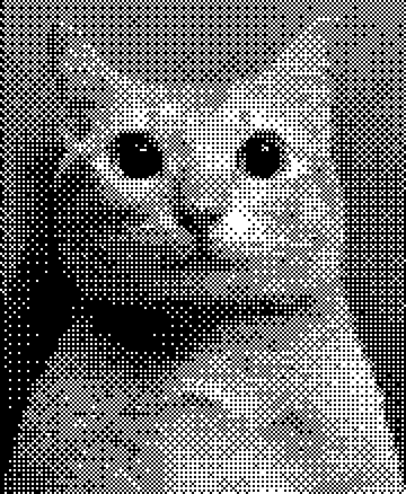

<p align="center">
  
</p>

# Bayer Dithering


A high-performance, GPU-accelerated Python library and Command-Line Interface (CLI) that applies Bayer matrix dithering to images, GIFs, and videos. 

It offers a variety of customizable options such as matrix size, custom color filters, sharpness, contrast, and downscaling, powered by parallel processing for blazing-fast media generation.

## Features
- **Hardware Acceleration:** Choose between CPU or GPU (`taichi` backend) for massive performance gains, especially on videos.
- **Universal Media Support:** Seamlessly process PNG, JPG, GIF, and MP4 files with automatic format detection.
- **Global CLI:** Install once and use the `dither` command from anywhere in your terminal.
- **Customizable Filters:** Apply beautiful retro color palettes easily.
- **Pre-Processing Pipeline:** Built-in options for downscaling, contrast adjustment, and sharpening before the dithering effect is applied.

## Installation

1. Clone the repository:
   ```bash
   git clone https://github.com/madmattp/Bayer-Dithering.git
   cd Bayer-Dithering
   ```
2. Install the package and its dependencies:
   ```bash
   pip install -e .
   ```
   *(This will install the required libraries and link the `dither` command to your system).*

## Usage

Once installed, you can use the `dither` command directly in your terminal.

### Command Line Options:

- `-i, --input`: **(Required)** Specifies the input file (image, gif, or video).

- `-a, --arch`: Processing hardware. Options: `cpu`, `gpu` (default: `cpu`).

- `-m, --matrix`: Selects the Bayer matrix size. Options: `2x2`, `4x4`, `8x8` (default: `4x4`).

- `-o, --output`: Specifies the output file path. If not provided, a default name will be automatically generated.

- `-f, --filter`: Applies a custom color filter to the output image (e.g., `Matrix`, `Orange`, `Vapor`).

- `-s, --sharpness`: Adjusts the sharpness (default: 1.6).

- `-c, --contrast`: Adjusts the contrast (default: 1.5).

- `-d, --downscale`: Downscales the image by a factor before dithering (default: 2).

- `-u, --upscale`: Upscales the image back to its original size after dithering (default: True). Set `-u false` to disable.

- `-q, --quiet`: Runs the script in quiet mode, suppressing terminal output.

### Recommended Settings
For more visually pleasing retro results, it is recommended to use the following settings:
- **Contrast: 1.5**

- **Sharpness: 1.6**

- **Downscaling: >= 2**

### Examples

#### 1. Dithering an Image:
  ```bash
  dither -i media/cat.jpg -m 4x4 -d 6
  ```

  <p align="center">
    
    
  </p>

#### 2. Dithering a Video with a Color Filter (**GPU Accelerated**):
  ```bash
  dither -i media/huh.mp4 -a gpu -m 4x4 -c 1.5 -s 1.6 -f Cyan
  ```

  <p align="center">
    <video src="media/huh.mp4" alt="huh.mp4" width="49%" controls></video>
    <video src="media/huh_dithered.mp4" alt="huh_dithered.mp4" width="49%" controls></video>
  </p>

## Python API Usage
You can also import `BayerDithering` directly into your own Python scripts to build custom graphics pipelines or integrate the effect into other applications.

### 1. Basic Image Processing (NumPy / OpenCV)
If you already have an image loaded as a NumPy array, you can process it directly:

```python
import cv2
from BayerDithering import BayerDither, CPUProcessor, DitherConfig, matrices

# Create the pipeline configuration
config = DitherConfig(
    b_matrix=matrices["4x4"],
    contrast=1.5,
    sharpness=1.6,
    downscale_factor=2,
    upscale=True,
    filter=None  # Pass a tuple of RGB colors or None for grayscale
)

# Initialize the processor (CPU or GPUProcessor) and the ditherer
processor = CPUProcessor(config)
ditherer = BayerDither(processor=processor, verbose=True)

# Apply dithering to a NumPy array (BGR image from OpenCV)
image = cv2.imread("media/cat.jpg")
dithered_image = ditherer.apply(image)

# Save the result
cv2.imwrite("media/cat_dithered.png", dithered_image)
```

### 2. High-Performance Video Processing (GPU Accelerated)
For processing videos, pass a `cv2.VideoCapture` object directly into the `apply` method. The pipeline leverages the `taichi` backend for parallel GPU frame processing and returns a `ProcessedVideo` context manager:

```python
import cv2
from BayerDithering import BayerDither, GPUProcessor, DitherConfig, matrices
from BayerDithering.utils import ProcessedVideo

config = DitherConfig(
    b_matrix=matrices["8x8"],
    contrast=1.3,
    sharpness=1.5,
    downscale_factor=2
)

# Use GPUProcessor for hardware acceleration
processor = GPUProcessor(config)
ditherer = BayerDither(processor=processor)

# Open the video stream using OpenCV
video_capture = cv2.VideoCapture("media/huh.mp4")

# Pass the video capture object to the ditherer.
# The router will automatically return a ProcessedVideo context.
# Always use 'with' to ensure secure handling and cleanup of temporary files.
with ditherer.apply(video_capture) as result:
    result.save_with_audio(original_video_path="media/huh.mp4", path="media/huh_dithered.mp4")

# Remember to release the video hardware resource
video_capture.release()
```

### 3. Animated GIF Processing
GIF processing relies on multi-frame arrays or lists of images. The `apply` method processes the frame sequence and returns a `ProcessedGIF` context manager to gracefully handle saving the output stream:

```python
import imageio as iio
from BayerDithering import BayerDither, CPUProcessor, DitherConfig, matrices
from BayerDithering.utils import ProcessedGIF

config = DitherConfig(
    b_matrix=matrices["4x4"],
    contrast=1.6,
    sharpness=1.4,
    downscale_factor=3,
    upscale=True
)

# Initialize using CPU or GPU (both support GIF frame-by-frame processing)
processor = CPUProcessor(config)
ditherer = BayerDither(processor=processor)

# Load the GIF frames as a single multi-frame NumPy array using imageio
with iio.get_reader("media/cat-shocked.gif") as gif_frames:

  # Pass the frame sequence object to the ditherer. 
  # The router will return a ProcessedGIF instance
  with ditherer.apply(gif_frames) as result:
    result.save(dest_path="media/cat_shocked_dithered.gif")
```

### 4. Loading Custom Filters Programmatically
If you want to use the color palettes defined in your [`filters.toml`](/BayerDithering/filters.toml) dynamically inside a Python script:

```python
from BayerDithering.utils import load_filters
from BayerDithering import DitherConfig, matrices

# Load all filters as a dictionary
filters = load_filters()

# Extract the RGB data for a specific palette (e.g., 'Cyan')
cyan_palette = filters.get("Cyan")

config = DitherConfig(
    b_matrix=matrices["4x4"],
    filter=cyan_palette  # Pass the loaded palette data to the configuration
)
```

## Contributions
Feel free to open issues or contribute via pull requests. Contributions are welcome!
